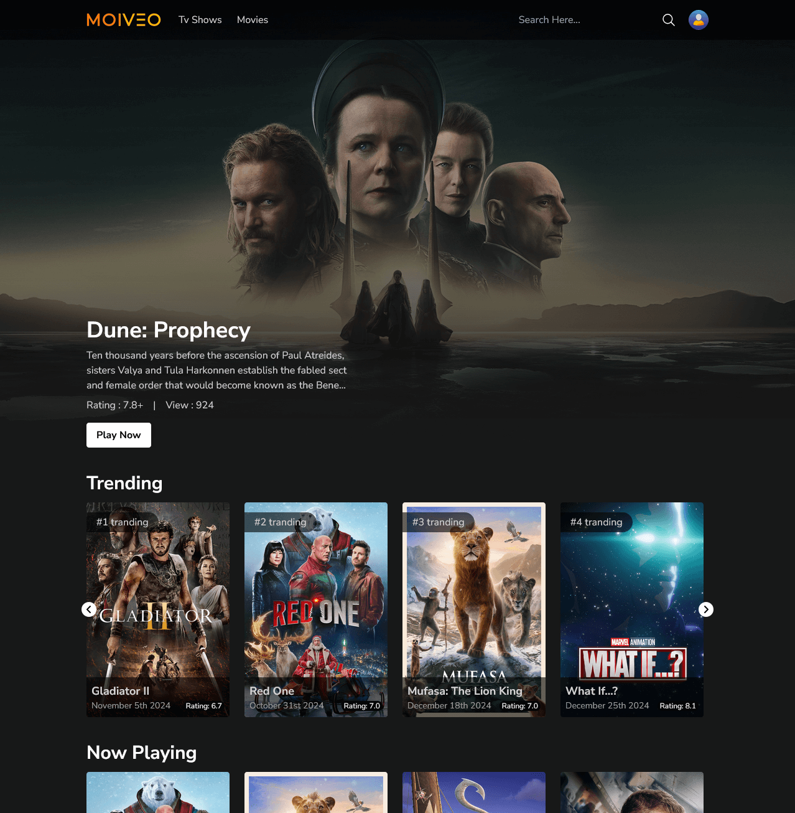
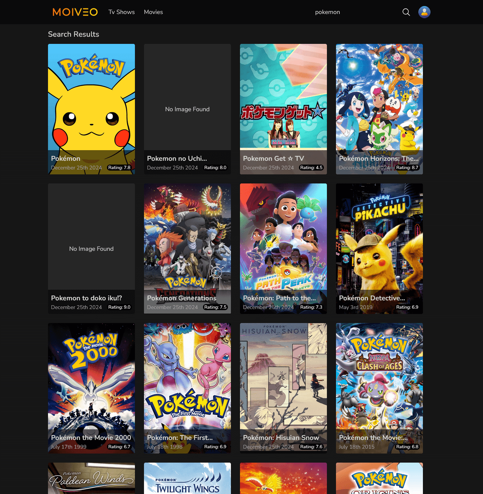
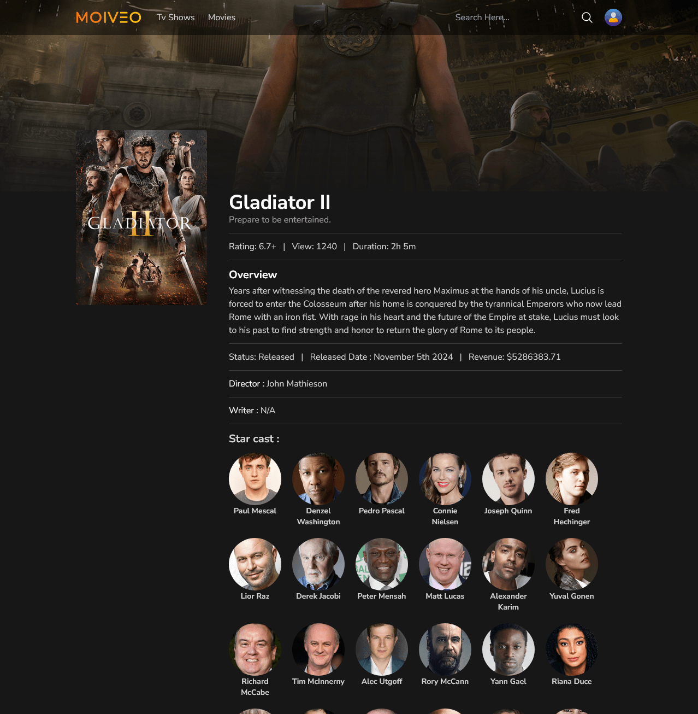

---

# 🎬 Movie Search Webpage  

Welcome to **Movie Search Webpage**, a sleek and user-friendly platform for exploring and discovering movies. Powered by **React**, **Redux**, and other modern tools, this application ensures a seamless experience for users.  


🌐 **[Live Demo](https://movie-app-redux-eight.vercel.app/)**  
📂 **[GitHub Repository](https://github.com/samirzjadhav/movie-app-redux)**  

---


## 🖼 Images  

Here are some images of the **Movie Search Webpage** in action:  

### Homepage  
  

### Movie Search Feature  
  

### Movie Details Page  
  

---

## 🛠 Features  

- 🔍 **Search Movies**: Quickly find movies by title using the search bar.  
- 🗓 **Release Dates**: Get details about movie release dates.  
- ⭐ **Popular and Trending**: Explore trending and popular movies.  
- 🕒 **Moments**: Integrated with **Moment.js** to display dates in a user-friendly format.  
- 📡 **Axios Integration**: Fetches movie data efficiently using Axios.  
- 🔄 **State Management**: Powered by **Redux Toolkit** for smooth and scalable state management.  
- 🌐 **Routing**: Navigate between pages effortlessly with **React Router DOM**.  
- 🎨 **Tailwind CSS**: Clean, modern, and responsive design.  

---

## 🚀 Tech Stack  

- **Frontend**: React, Redux Toolkit, React Router DOM  
- **Styling**: Tailwind CSS  
- **API Handling**: Axios  
- **Date Management**: Moment.js  
- **Icons**: React Icons  

---

## 📦 Dependencies  

Here's the list of major dependencies used in the project:  

```json  
{
  "@reduxjs/toolkit": "^2.3.0",
  "axios": "^1.7.7",
  "moment": "^2.30.1",
  "react": "^18.3.1",
  "react-dom": "^18.3.1",
  "react-icons": "^5.3.0",
  "react-redux": "^9.1.2",
  "react-router-dom": "^6.28.0",
  "tailwindcss": "^3.4.15"
}
```  

---

## 🛠 Getting Started  

### Prerequisites  

- Node.js and npm installed.  

### Installation  

1. Clone the repository:  
   ```bash  
   git clone https://github.com/your-username/movie-app.git  
   ```  

2. Navigate to the project directory:  
   ```bash  
   cd movie-app  
   ```  

3. Install dependencies:  
   ```bash  
   npm install  
   ```  

4. Start the development server:  
   ```bash  
   npm start  
   ``` 

## 📄 License  

This project is licensed under the **MIT License**.  

--- 

Thank you for visiting **Movie Search Webpage**! Feel free to explore the codebase, provide feedback, and enjoy the app! 🎥  
